# 🛍️ Retail Sales Analytics Dashboard  
### *End-to-End Data Analysis using Python, MySQL & Tableau Public*

---

## 📖 Overview  
This project showcases a complete data analysis pipeline — from raw CSV files to interactive dashboards — using **Python**, **MySQL**, and **Tableau Public**.  
The dataset represents a multi-store retail company dealing in bikes and accessories, containing information about customers, products, orders, stores, and staff.

---

## 🎯 Objectives  
- Clean and preprocess raw data using Python  
- Store and manage data in a MySQL relational database  
- Use SQL for data transformation, validation, and extraction  
- Build interactive Tableau dashboards to visualize insights and KPIs  

---

## 🗃️ Database Structure  

The database consists of multiple interconnected tables that describe the business operations of a retail store.

---

## 📖 Problems and Results

💰 1. Sales Performance Analysis
- Problem 1: Which stores generate the highest revenue and growth?  
  Solution:  
  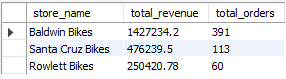  
- Problem 2: What are the top-selling products and categories?  
  Solution:  
  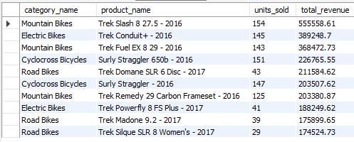  
- Problem 3: How do sales vary by season or month?  
  Solution:  
  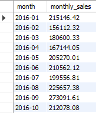  

🧍 2. Customer Behavior & Loyalty
- Problem 4: Who are our most valuable customers (top spenders)?  
  Solution:  
  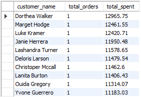  
- Problem 5: Which states or cities bring the most customers and sales?  
  Solution:  
  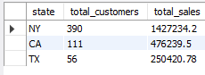  

🏷️ 3. Product & Inventory Management
- Problem 6: Which products are running low in stock?  
  Solution:  
  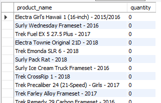  
- Problem 7: Which brands perform best across stores?  
  Solution:  
  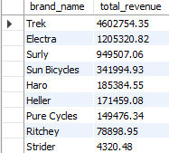  

👨‍💼 4. Staff & Operational Efficiency
- Problem 8: Which staff members drive the most revenue?  
  Solution:  
  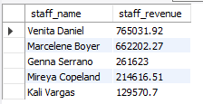  
- Problem 9: How efficient is order processing (order to shipment)?  
  Solution:  
  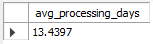  
- Problem 10: How do discounts affect total revenue?  
  Solution:  
  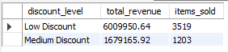  

---

## 🧩 Tools & Technologies  

| Tool | Purpose |
|------|----------|
| **Python (pandas)** | Data cleaning and preparation |
| **MySQL** | Data storage, transformation, and querying |
| **Tableau Public** | Visualization and dashboard creation |
| **CSV / Excel** | Data source and export format |

---

## 📊 Tableau Dashboard  

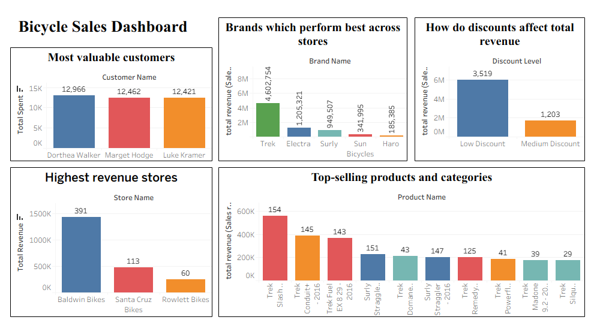  

---

## 📈 Key Business Insights  
- Trek is best brand accros our all stores.  
- There are multiple people spend more than 12k in our stores.  
- Low discounts effectively increase revenue but Medium discounts dont generates much revenue.  
- Baldwin Bikes Produce most of revenue.  

---

## 🚀 Future Improvements  
- Automate the data refresh process between Python → MySQL → Tableau  
- Add profit margin and inventory turnover KPIs  
- Incorporate predictive analytics for sales forecasting  

---

## ✍️ Author  
**Bhushan Yashwant Patil**  
📧 Email: [patilbhushan1086@gmail.com]  
🔗 LinkedIn: [https://www.linkedin.com/in/bhushan-patil-381601293/]
